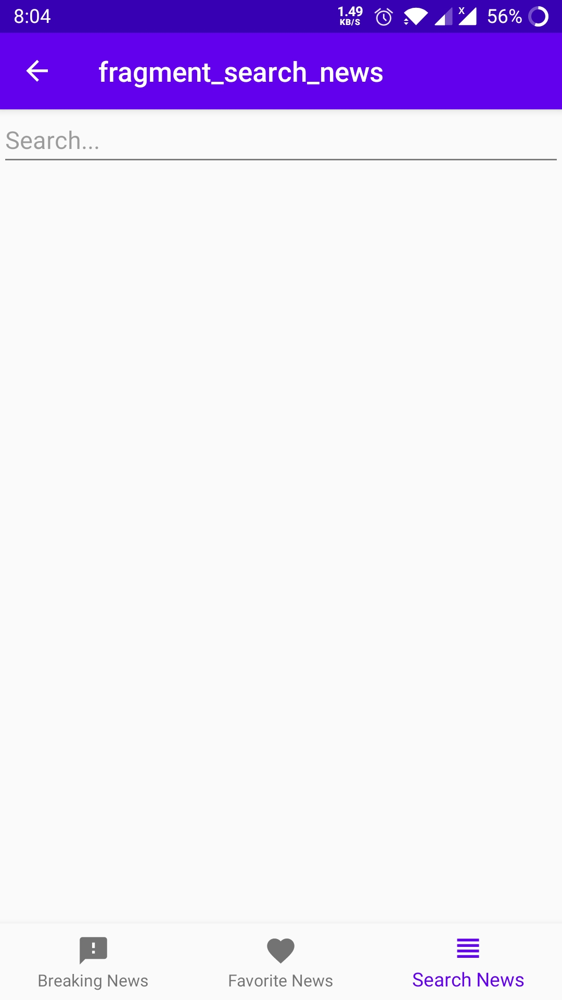

# NewsPaper

A news paper app using newsapi.org restapi

### About this App

* News paper apps use a REST API as a data source and use room for local data saving..

## Architecture

The project uses MVVM architecture pattern.

## Libraries 

* [DataBinding](https://developer.android.com/topic/libraries/data-binding) - support library that allows binding of UI components in layouts to data sources,binds character details and search results to UI
* [Navigation Component](https://developer.android.com/guide/navigation/navigation-getting-started) - Android Jetpack's Navigation component helps in implementing
navigation between fragments
* [Retrofit](https://square.github.io/retrofit/) - To access the Rest Api
* [Coroutines](https://developer.android.com/kotlin/coroutines/) - To Handle network call
* [ViewModel](https://developer.android.com/topic/libraries/architecture/viewmodel/) - Manage UI related data in a lifecycle conscious way and act as a channel between use cases and ui
* [Dagger Hilt](https://developer.android.com/training/dependency-injection/hilt-android/) - Hilt is a dependency injection library for Android that reduces the boilerplate of doing manual dependency injection in this project
* [Room Database](https://developer.android.com/training/data-storage/room/) - To store offline data and save favourite posts
* [ViewPager2](https://developer.android.com/jetpack/androidx/releases/viewpager2) - to manage multiple fragments for categores 

## App [Link](https://github.com/shaunhossain/News-Paper/releases/download/v1.0/NewsPaper.apk)

## Screenshots
|||||
|:----:|:----:|:----:|:----:|

||
|:----:|

